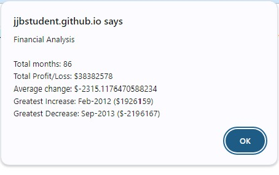
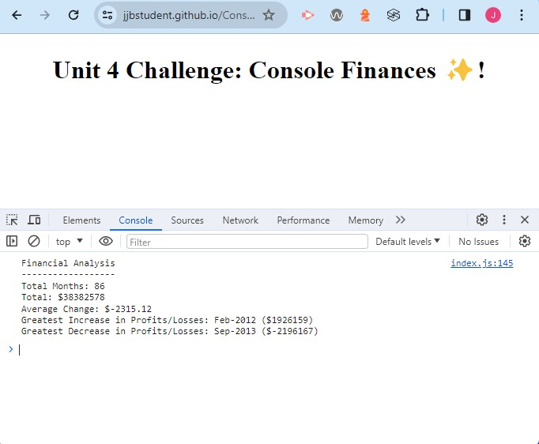

# Financial Analysis Project

## Overview

This project performs a financial analysis based on a dataset containing monthly financial data. It calculates key metrics such as total profit/loss, average change, and identifies months with the greatest increase and decrease in profits/losses.

## Features

- **Total Months:** Calculates the total number of months in the dataset.
- **Total Profit/Loss:** Computes the net total amount of profit/losses over the entire period.
- **Average Change:** Calculates the average change in profit/losses from month to month.
- **Greatest Increase/Decrease:** Identifies the months with the greatest increase and decrease in profits/losses, along with the corresponding amounts.

- ScreenShots

## Usage

1. **Dataset:** Ensure your financial data is structured in the same format as the provided sample.
2. **Run the Code:** Execute the script in a JavaScript environment to perform the financial analysis.
3. **View Results:** Results will be displayed in the console log and an alert box.

## How to Run

Ensure you have a JavaScript environment. You can run the script in a web browser console or a Node.js environment.

Use the link provided to access the project 

https://jjbstudent.github.io/Console-Finances/

## Contributions 

Resources used for the project

1. XpertLearning Assistant - for some of the calulations
2. https://developer.mozilla.org/en-US/docs/Learn/JavaScript/First_steps/Math
3. https://www.w3schools.com/js/js_arithmetic.asp

## Licence 

MIT licence
